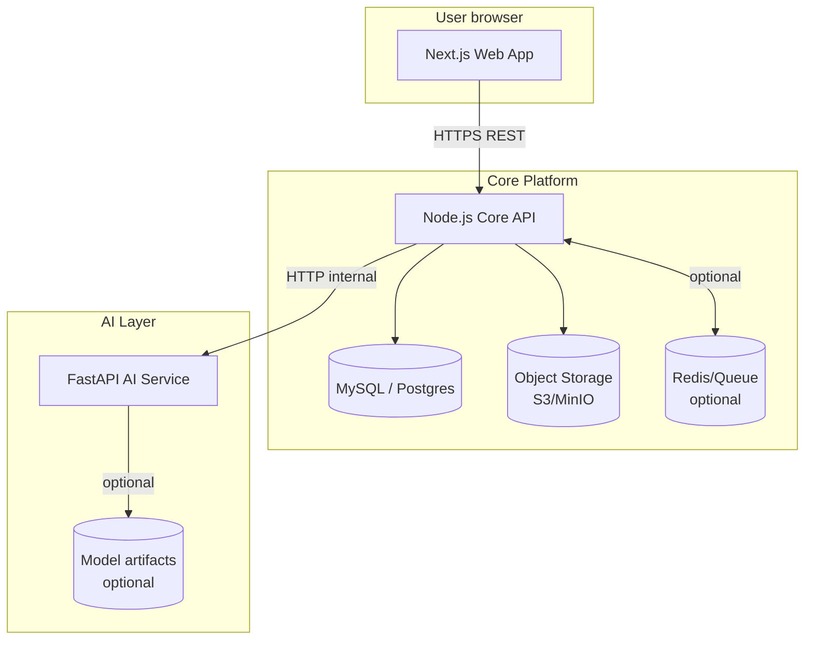

## System architecture (AI-CSGTS)

### High-level goals

- **Multi-tenant SaaS-ready**: isolate data by `tenant_id` (company) and enforce it in every query.
- **Enterprise security**: JWT access tokens + refresh tokens, RBAC, audit logs, least privilege.
- **Scalable analytics**: dashboards, gap analysis, recommendations, and AI services decoupled from core API.
- **Integration-ready**: HRIS/LMS connectors, SSO/OAuth later, export/import.

### Services

- **Web app** (`apps/web`): Next.js + Tailwind. Role-specific dashboards. Charts + report builder UI.
- **Core API** (`apps/api`): REST API (TypeScript). Implements auth, RBAC, workflows, modules, reporting.
- **AI service** (`apps/ai`): FastAPI. Skill extraction (NLP), matching, recommendations, forecasting stubs.
- **DB**: MySQL or Postgres. Row-level tenant isolation via `tenant_id` + indexes + constraints.
- **Object storage**: for certifications/uploads (S3/MinIO). Local filesystem in dev.
- **Async jobs** (recommended): queue for heavy AI/batch tasks (BullMQ/Redis). Phase 2.

### Core auth model

- **Identity**: user belongs to one tenant. HR approval required for activation.
- **Access**: short-lived JWT access token, refresh token rotation, device/session tracking.
- **Authorization**: RBAC + permission matrix (role → permissions). Optional fine-grained scopes.
- **Audit**: write immutable audit log entries for security and compliance.

### Data flows

- **Login**: Web → API `/auth/login` → JWT + refresh → Web stores (httpOnly cookies recommended).
- **AI recommendation**: Web/API → API calls AI service with sanitized data → AI response persisted to DB.
- **Gap analysis**: API computes gaps (employee skills vs role/project requirements) and stores snapshots.
- **Dashboards**: API aggregates KPIs; precompute for scale (materialized views/ETL in later phase).

### Architecture diagram (Mermaid)

### Module-to-service mapping

- **User & Role management**: API + Web (HR approval, directory, import/export, logs)
- **Competency profiles**: API + Web (self + manager assessments, endorsements, uploads)
- **Skill gap analysis**: API (compute + snapshots) + Web (visuals, exports)
- **AI analytics**: AI service (NLP, recommendations, forecasting) + API orchestration
- **Training**: API + Web (tracking, ROI, budget)
- **Resource allocation**: API + Web (matching, calendar, conflict detection)
- **Reporting**: API (query builder + exports) + Web (dashboards)
- **Audit/history**: API + DB (append-only logs, version tracking)
- **Admin/config**: API + Web (taxonomy, permissions, integrations)

### Scalability notes

- Start with **monolith API** (modular), migrate to microservices later if needed.
- Add **read models** for dashboards (nightly/hourly jobs) when dataset grows.
- Use **database indexing strategy**: `(tenant_id, <foreign_key>)` on most tables.

