## Database design (relational, multi-tenant)

### ERD (Mermaid)

```mermaid
erDiagram
  TENANTS ||--o{ USERS : has
  TENANTS ||--o{ ROLES : defines
  ROLES ||--o{ USER_ROLES : grants
  USERS ||--o{ USER_ROLES : assigned

  TENANTS ||--o{ SKILLS : catalogs
  SKILLS ||--o{ EMPLOYEE_SKILLS : measures
  USERS ||--o{ EMPLOYEE_SKILLS : owns

  USERS ||--o{ CERTIFICATIONS : has
  USERS ||--o{ EXPERIENCE_TIMELINE : has

  TENANTS ||--o{ PROJECTS : owns
  PROJECTS ||--o{ PROJECT_REQUIREMENTS : needs
  SKILLS ||--o{ PROJECT_REQUIREMENTS : required

  TENANTS ||--o{ TRAINING_PROGRAMS : offers
  TRAINING_PROGRAMS ||--o{ ENROLLMENTS : includes
  USERS ||--o{ ENROLLMENTS : enrolls

  USERS ||--o{ GAP_ANALYSIS_SNAPSHOTS : evaluated
  USERS ||--o{ RECOMMENDATIONS : receives

  USERS ||--o{ ACTIVITY_LOGS : emits
  USERS ||--o{ LOGIN_HISTORY : signs_in
  USERS ||--o{ AUDIT_LOGS : audited_actor

  TENANTS {
    uuid id PK
    string name
    string slug
    datetime created_at
  }

  USERS {
    uuid id PK
    uuid tenant_id FK
    string email
    string password_hash
    string full_name
    string department
    string title
    string status  "PENDING|ACTIVE|SUSPENDED"
    datetime approved_at
    uuid approved_by FK
    datetime created_at
  }

  ROLES {
    uuid id PK
    uuid tenant_id FK
    string name "EMPLOYEE|MANAGER|HR_ADMIN|SYSTEM_ADMIN"
    string description
    datetime created_at
  }

  USER_ROLES {
    uuid user_id FK
    uuid role_id FK
    datetime created_at
  }

  SKILLS {
    uuid id PK
    uuid tenant_id FK
    string name
    string category
    string description
    boolean active
  }

  EMPLOYEE_SKILLS {
    uuid id PK
    uuid tenant_id FK
    uuid user_id FK
    uuid skill_id FK
    string level "BEGINNER|INTERMEDIATE|ADVANCED|EXPERT"
    int self_score
    int manager_score
    int endorsements_count
    datetime last_used_at
    datetime updated_at
  }

  CERTIFICATIONS {
    uuid id PK
    uuid tenant_id FK
    uuid user_id FK
    string name
    string issuer
    date issued_on
    date expires_on
    string file_url
  }

  EXPERIENCE_TIMELINE {
    uuid id PK
    uuid tenant_id FK
    uuid user_id FK
    string org
    string role
    date start_date
    date end_date
    string summary
  }

  PROJECTS {
    uuid id PK
    uuid tenant_id FK
    string name
    string code
    string status
    date start_date
    date end_date
  }

  PROJECT_REQUIREMENTS {
    uuid id PK
    uuid tenant_id FK
    uuid project_id FK
    uuid skill_id FK
    string required_level
    int required_headcount
  }

  TRAINING_PROGRAMS {
    uuid id PK
    uuid tenant_id FK
    string title
    string provider "Internal|Coursera|Udemy|Other"
    string url
    int duration_hours
    decimal cost
    string skills_covered_json
  }

  ENROLLMENTS {
    uuid id PK
    uuid tenant_id FK
    uuid user_id FK
    uuid training_program_id FK
    string status "PLANNED|IN_PROGRESS|COMPLETED|DROPPED"
    int progress_percent
    datetime started_at
    datetime completed_at
  }

  GAP_ANALYSIS_SNAPSHOTS {
    uuid id PK
    uuid tenant_id FK
    uuid user_id FK
    string scope_type "ROLE|PROJECT"
    uuid scope_id
    decimal severity_score
    string result_json
    datetime created_at
  }

  RECOMMENDATIONS {
    uuid id PK
    uuid tenant_id FK
    uuid user_id FK
    string type "TRAINING|SKILL|PROJECT"
    string payload_json
    decimal confidence
    datetime created_at
  }

  LOGIN_HISTORY {
    uuid id PK
    uuid tenant_id FK
    uuid user_id FK
    string ip
    string user_agent
    datetime created_at
  }

  ACTIVITY_LOGS {
    uuid id PK
    uuid tenant_id FK
    uuid user_id FK
    string action
    string entity_type
    uuid entity_id
    string metadata_json
    datetime created_at
  }

  AUDIT_LOGS {
    uuid id PK
    uuid tenant_id FK
    uuid actor_user_id FK
    string event_type
    string entity_type
    uuid entity_id
    string before_json
    string after_json
    string ip
    datetime created_at
  }
```

### Notes / extensions for enterprise use

- **Permissions**: add `PERMISSIONS` + `ROLE_PERMISSIONS` tables if you want configurable RBAC per tenant.
- **Endorsements**: add `SKILL_ENDORSEMENTS(user_id, skill_id, endorsed_by, comment)` for full trail.
- **Versioning**: add `ENTITY_VERSIONS` for diff/compare beyond audit logs.
- **Skill taxonomy**: add `SKILL_GROUPS`, `SKILL_ALIASES`, `SKILL_RELATIONSHIPS` for NLP normalization.

